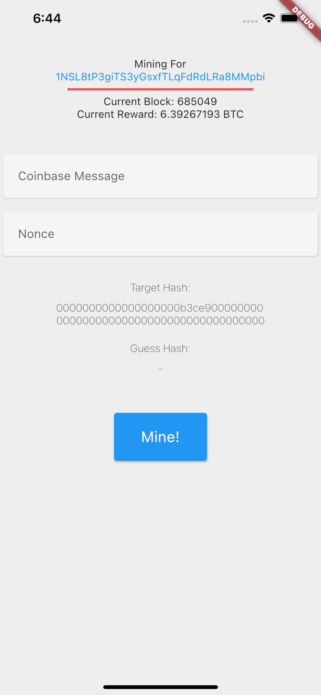
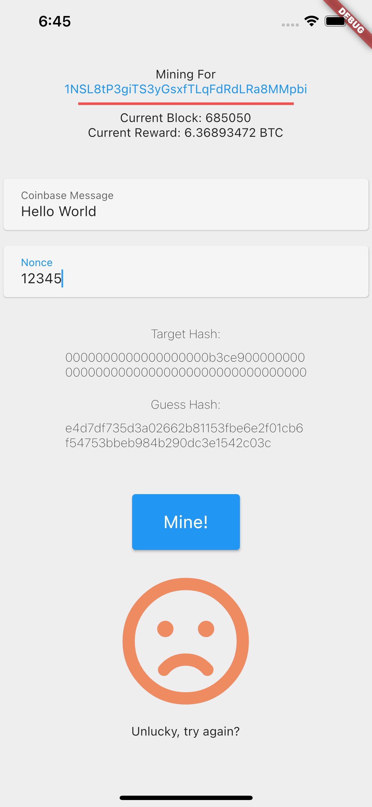
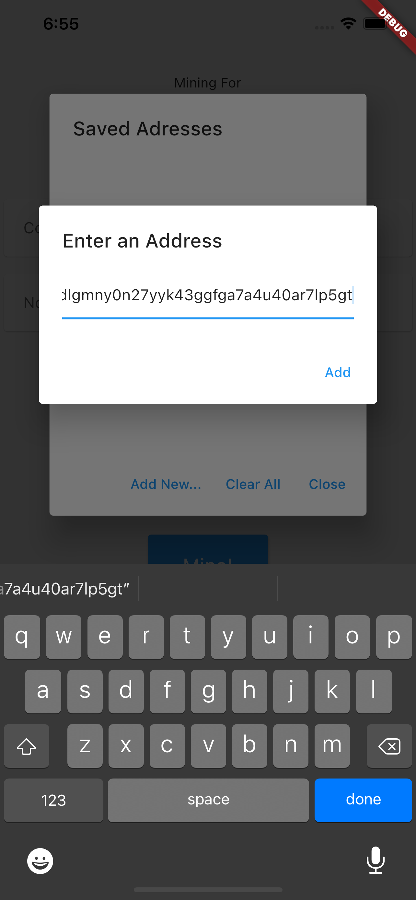
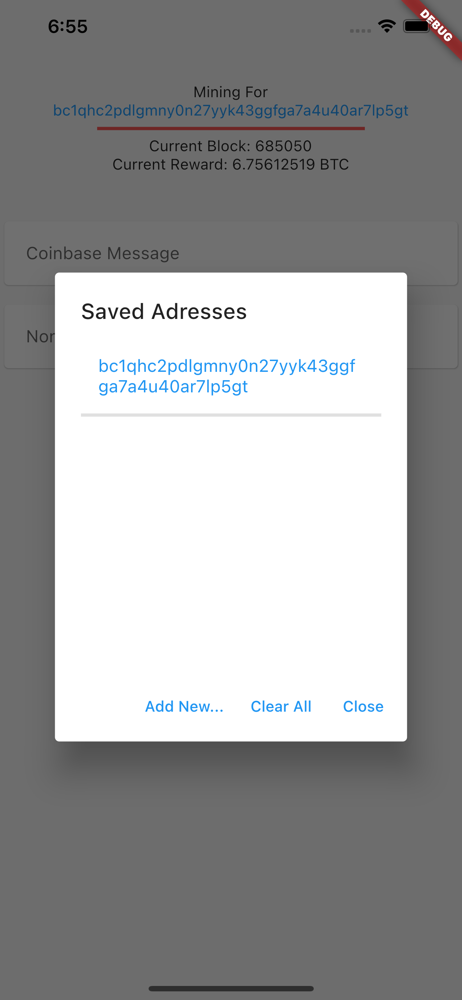

# manminer

Why mine BTC with ASIC when you can mine BY HAND?

## Getting Started

This project is a Flutter application that interacts directly with the bitcoin blockchain through JSON_RPC.

open up a bitcoin daemon and set your rpc config in `lib/utils/ENV_VARS.dart`.

run and guess a nonce.

???

Profit??

## Screenshots

